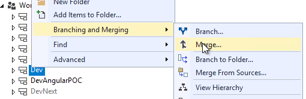
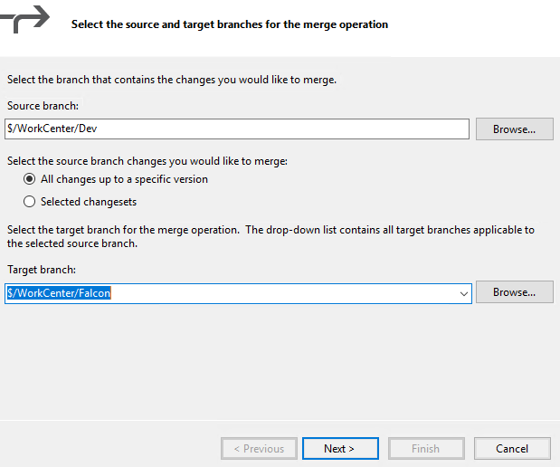
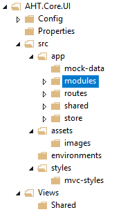
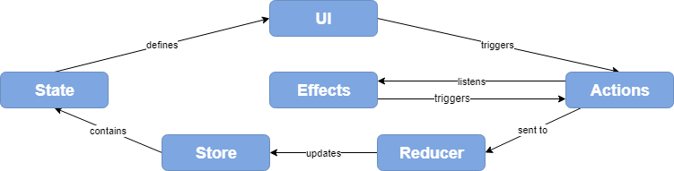
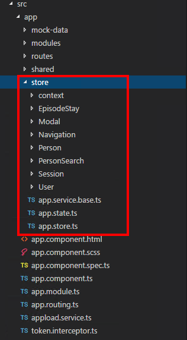

# AHT.Core.UI Framework 
### Angular-based framework for Future Development
 
## 1 - Overview

Our team was tasked with the development of a new UI framework that allows existing code to continue to work (mostly) and creates an foundation for future development.

## 2 - Prerequisites

As of (TODO), the Dev branch of Workcenter has added the AHT.Core.UI folder to the WorkCenter Branch. 

**Merge DEV branch into your teams branch.**

Right click on the Dev branch, navigate to "Branching and Merging" and click "Merge..." 

Select your teams Workcenter branch as the target branch. Follow the Dialogs getting the latest version of Workcenter\Dev merged into your team branch.

After merge, you should see the following folder structure populated under your team bracnch:

**Download and Install Visual Studio Code**

We've found that Visual Studio Code is a fast and lightweight IDE that has a number of plugins that make Angular Development easier.

Browse to [https://code.visualstudio.com/](https://code.visualstudio.com/ "https://code.visualstudio.com") to download and run the installer.

(Optional) Add these Recommended Extensions to Visual Studio Code

- [Move TS - Move TypeScript files and update relative imports](https://marketplace.visualstudio.com/items?itemName=stringham.move-ts)
- [SCSS IntelliSense](https://marketplace.visualstudio.com/items?itemName=mrmlnc.vscode-scss)
- [TSLint](https://marketplace.visualstudio.com/items?itemName=eg2.tslint)
- [Auto Import](https://marketplace.visualstudio.com/items?itemName=steoates.autoimport)

Other Useful Information

- [Keyboard Shortcuts for Visual Studio](https://code.visualstudio.com/shortcuts/keyboard-shortcuts-windows.pdf)

**Download and Install Node Package Manager**

Follow the instructions at [https://www.npmjs.com/get-npm](https://www.npmjs.com/get-npm) to install npm.

**(Recommended) Redux Dev-Tools Chrome Extension**

Download and install [Redux Dev Tools for Chrome](https://chrome.google.com/webstore/detail/redux-devtools/lmhkpmbekcpmknklioeibfkpmmfibljd?hl=en)

## 3 - Getting Started
**Basic Overview**

Layout_Template
webpack build

**Building the AHT.Core.UI**

npm install

npm run build

**Running locally**

npm install

npm run build

**Committing Changes via Source Explorer in Visual Studio (NOT Visual Studio Code)**

..adding new files.

Things to do things not to do.

## 4 - New Concepts

**NGRX Store Overview**

The NGRX store is a state management tool for Angular applications that is inspired by Redux. 

The purpose of the store is to be the driving force behind any UI changes. In traditional UI development, our application state is mostly driven by the DOM and updated with actions that occur in a non-centralized way. 

With the Store, we hope to centralize all UI actions and the results**** of those actions into the store. In most scenarios, we'd hope to see a mutation of the NGRX store as the cause of a UI update. **However, we are not going to be dogmatic about this concept**. If you need to animate or make simple self-contained UI changes, mutating the store is not necessary.

**File Structure**

If you think of the Store as a simple JSON object it might look something like this:

    {
	    "Context": { ... },
	    "EpisodeStay": { ... },
	    "Modal": { ... },
	    "Navigation": { ... },
	    "Person": { ... },
	    "PersonSearch": { ... },
	    "Session": { ... },
	    "User":{ ... }
    }

The store file structure should mimic the stores internal `JSON` structure:

Still Debating 

- *Flat vs Nested* and *Feature vs Entity Normalized*

### Implementation Details

When building a UI using the NGRX Store, you will often need to create multiple Actions, Reducers, and States.

If you need to make an API request (or need other complex updates off a single action) you'll also need to create an Effect.

To help illustrate this process, we'll go through the example of `GetUserDetails` which was one of the first things must do after loading the application.

**Store States**

It's often easiest to start with the State when thinking through a new feature/requirement. This helps you make sure you don't already have what you need somewhere else in the store.

For User Details in the JSON-concept of the store we need to look at:

	{
		"User": {
			details:{...}
		}
	}

This is defined in a file called `\Store\User\user.state.ts`:

	export interface UserState {
	    details: UserDetail;
		roleFacility: CurrentRoleFacility;
	}
	
	...

**Actions**

If we want to set the User.details object in the store, we'll need to dispatch an action.

Actions are dispatched to the Store and will result in a mutation of the state (usually).

An action should be something triggered by a user, or through a effect which processes user interactions, or from from external sources like SignalR.

Actions require a `type` but usually include a `payload`.

So in `\Store\User\user.actions.ts` we create a the following action:

	export enum UserActionTypes {
	    GETUSERDETAILS = '[User] GetUserDetails',
	    ...
	}
	
	
	export class GetUserDetails implements Action {
	    readonly type = UserActionTypes.GETUSERDETAILS;
	
	    constructor(public payload: String= '0') {}
	}

We define our `type` through an enum class so that it can be used throughout the application as necessary, but we only have to change it one spot to effect the actual value.

As you can see in the `GetUserDetails` action we have extended Action our payload is a type `String` for the user's ID/identifier

We also need to add the `GetUserDetails` action to the Union Type for type safety in the reducer.

	export type UserActions
	    = GetUserDetails
	    | GetUserDetailsSuccess
	    | GetUserDetailsError
	    | UpdateUserRoleFacility
	    | UploadUserImage
	    | UploadUserImageSuccess
	    | UploadUserImageError;

**Reducers**

Reducers are responsible for taking a action and mutating the store state based upon the payload and action type.

In `\Store\User\user.reducer.ts` we add all our reducers for the User branch.

	export function userReducer(state: UserState = { details: null, roleFacility: null}, action: UserActions | SessionActions) {
	    switch (action.type) {
	        case UserActionTypes.GETUSERDETAILS_SUCCESS:
	            return {
	                ...state,
	                details : {
	                    ...action.payload
	                },
	                roleFacility: {
	                    selectedFacilityCode: action.payload.LastSelectedFacilityCode,
	                    selectedRoleCode: Number(action.payload.LastSelectedRoleCode),
	                    SessionFacility: {
	                        Cono: action.payload.LastSelectedFacilityCode,
	                        Id: action.payload.FacilityId,
	                        Identifier: null,
	                        GMTOffSet: action.payload.GMTOffSet,
	                        ObservesDayLightSavings: action.payload.ObserveDayLightSaving
	                    }
	                }
	                
	            };
		    ...
	        default:
	            return state;
	    }
	}

If you notice, we have `UserActionTypes.GETUSERDETAILS_SUCCESS` in the switch statement, but not `UserActionTypes.GETUSERDETAILS`. This is because the `GetUserDetails` action depends on an API request, which could have at least 2 results `Status Code 200` and `Status Code 500`

**Effects**

## 5 - Components

Store is the source component UI.

## 6 - Angular Services vs API Services

## 7 - Style Guide